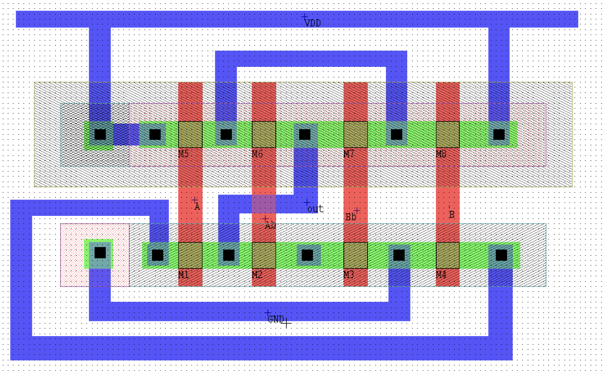
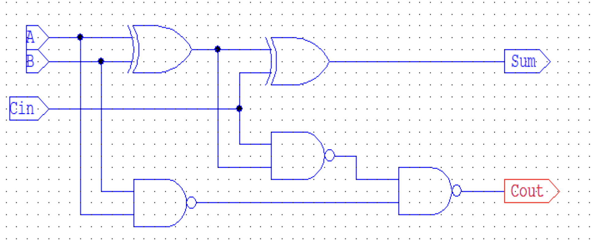
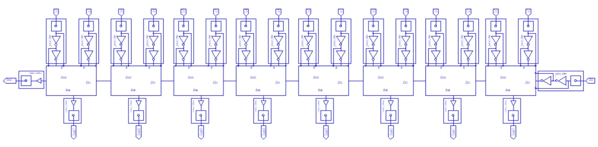
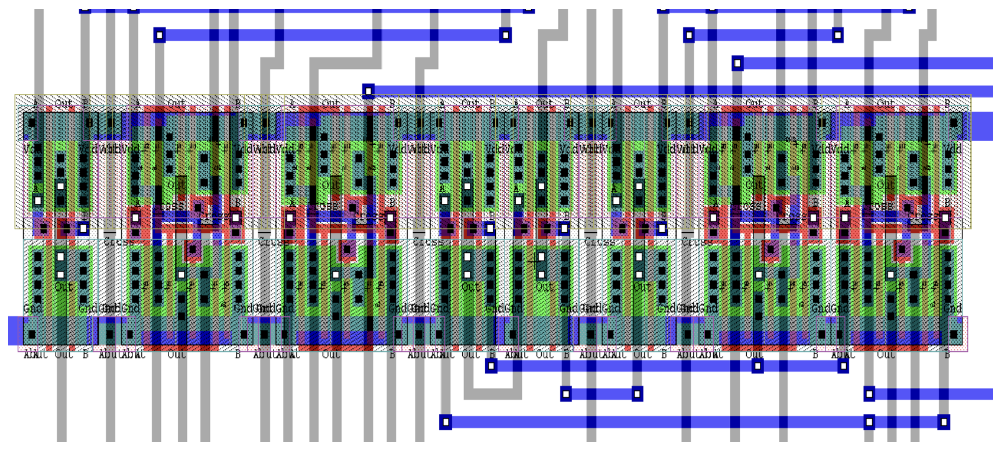

# L-Edit and S-Edit Projects

## Layout Design of an XOR Gate Using L-Edit

### XOR Gate Layout:

##Layout Design of an 8-bit Full Adder Gate Using S-Edit
### Full Adder:

### 8-bit Full Adder:

### Layout of 8-bit Full Adder:

